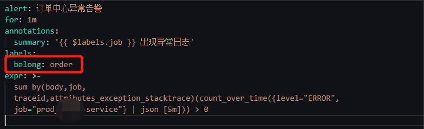
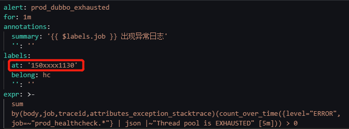

# DingDingAlertWebHook
在落地Opentelemetry时携带的日志告警webhook，模拟alertmanager接口，接受并处理Loki告警组件Ruler的Post请求。

只针对*opentelemetry-java-instrumentation*接收的日志告警进行处理

注意事项及功能：

- 处理了DingDing机器人WebHook的频率限制

  - 限速，控制在1分钟15次请求

  - 丢弃，在告警发送10分钟后仍没有申请到限速令牌，则丢弃该次告警

- 处理了DingDing机器人WebHook的内容大小限制

  - body和堆栈信息进行限制

- 通过环境变量确认通道和webhook的对应关系，需要以`WEB_HOOK_`开头

  - 示例ENV：WEB_HOOK_order=yourdingdingwebhook
  - 引用告警通道：在lokiRuler的配置中携带该label，例如下图配置：
    

- 实现了去重、限速、缓存功能

  - 对所有请求接收的告警对象的traceID和endtime进行去重
  - 过滤后的告警对象再进行缓存，避免大量重复告警，一直重复的告警每小时只告警一次
  - 每个机器人每分钟15次通知的限制
- 实现@关联联系人功能，提高关注度

  - 在lokiRuler配置中携带`at`这个label即可，value是钉钉群中的某个用户的手机号，例如下图配置
    

